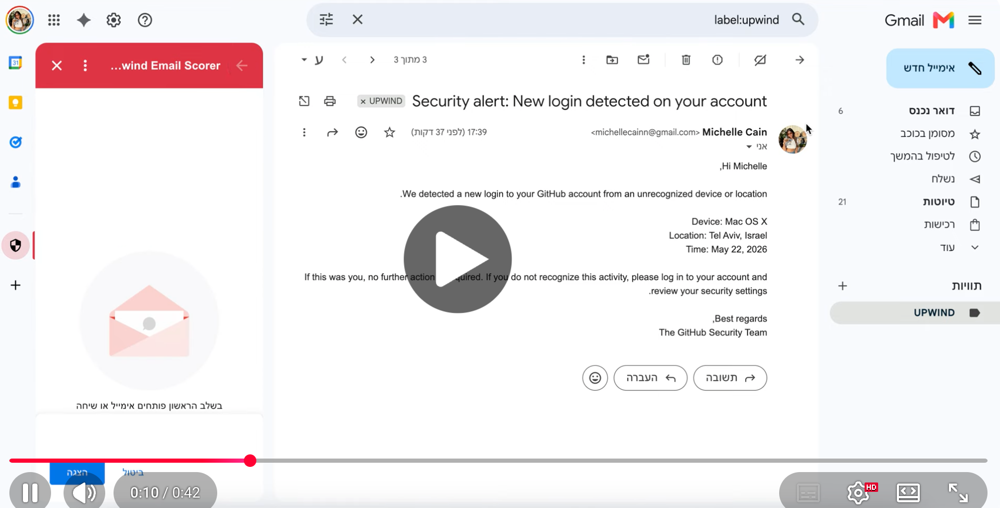

# Part 1 - Gmail Add-on: Malicious Email Scorer
<p align="center">
  
</p>

<p align="center"><b>Next-Gen Phishing Intelligence & Real-time Email Scoring Engine</b></p>

A Gmail add-on that analyzes opened emails and produces a risk score with a clear verdict.

## Architectural Decisions & Trade-offs
### Why a Dedicated Backend instead of a purely client-side script?

While Google Apps Script (GAS) allows full implementation within a single serverless environment, this project purposefully adopts a **Decoupled Architecture** (Google Apps Script as a lightweight client frontend, and a FastAPI Python service as the heavy threat analysis engine). 

This design decision was driven by key engineering and security principles:

* **Secrets Management & Reduced Attack Surface:** Running threat analysis entirely on the client-side (GAS) risks exposing sensitive third-party API tokens. Moving this logic to a dedicated backend keeps all credentials securely encapsulated inside server-side environment variables (`.env`).
* **Decoupling & Performance (Separation of Concerns):** Apps Script has tight execution time limits (max 30 seconds) and limited computational power. Offloading heavy regex operations, external intelligence aggregation, and database interactions to a Python backend ensures a high-performance, non-blocking user experience.
* **Persistent Analytics & Threat Intel History:** To fulfill the requirement of tracking scan history for context, a structured relational database (`SQLite`) was integrated. Managing high-throughput read/write history is significantly faster and more scalable through a dedicated database than utilizing GAS internal key-value storage (`PropertiesService`).
* **Extensibility:** A modular Python backend seamlessly enables the future integration of advanced security tools, such as sandboxed attachment analysis, Machine Learning classification models, and advanced heuristics.

The project has two parts that work together:

**Apps Script (addon/Code.gs)**
Runs inside Gmail. When an email is opened, it extracts the subject, sender, body, and URLs, sends them to the backend, and displays the result as a side panel card.

**Python Backend (backend/)**
Runs locally. Handles the actual analysis logic, calls external APIs, and stores scan history in a local SQLite database.
Gmail → Apps Script → ngrok → Python Backend → result back to Gmail

## System Architecture

```text
[Gmail Client Interface]
       │
       │ (Contextual Trigger on Email Open)
       ▼
[Google Apps Script] ─── (Extracts Metadata/Body)
       │
       │ (Secure HTTP POST via ngrok tunnel)
       ▼
[FastAPI Python Backend] ─── (Enrichment Queries) ───► [Google Safe Browsing API]
       │
       ├─► [Scoring Engine] (Computes composite risk metrics)
       ├─► [SQLite Database] (Persists scan metrics & history logs)
       │
       ▼ (Returns Unified JSON Payload)
[Google Apps Script] ─── (Renders Dynamic UI) ───► [User Sidebar Panel]
``` 

## Features & Risk Signals

The scoring engine operates on a deterministic heuristic model, assessing multiple independent vector signals up to a maximum **Risk Score of 100**:

| Signal Name | Risk Weight | Analysis Mechanism & Security Value |
| :--- | :---: | :--- |
| Phishing Keywords | +30 Points | Scans the email body using optimized regex matching for classic social engineering trigger words (e.g., urgency, account suspension, immediate financial confirmation). |
| Sender Mismatch | +25 Points | Analyzes the `From` and `Reply-To` headers to detect spoofing patterns, ensuring that potential responses are not routed to a domain different from the sender's origin. |
| URL Reputation | +50 Points | Extracts links from the email body and queries the Google Safe Browsing API to check for known malware, social engineering schemes, and blacklisted domains. |
| URL Count Density | +15 Points | Evaluates the quantity of embedded URLs. A high link-to-text density is a strong structural indicator of mass phishing campaigns. |
| Homoglyph Detection | +40 Points | Detects internationalized non-ASCII characters in the sender's domain. This flags sophisticated homograph attacks where visually identical characters (e.g., Cyrillic 'а') are used to impersonate trusted brands. |
| Domain Age Check | +35 Points | Queries the global public RDAP registry dynamically to analyze domain registration dates. Senders utilizing newly registered domains (<30 days old) are heavily penalized due to high phishing correlations. |

> **Contextual Scanning History:** The add-on dynamically retrieves the 10 most recent scans from the SQLite storage, providing critical historical context on previously scanned senders and results.


---

## Technical Stack & APIs

* **Frontend UI:** Google Apps Script Card-Based Add-on Framework.
* **Backend Framework:** FastAPI (Python 3.9+) — selected for its asynchronous capabilities and native Pydantic data validation.
* **Database:** SQLite3 — chosen for zero-configuration, lightweight relational data persistence.
* **External APIs:** Google Safe Browsing API (v4 Threat Matches).

## How to Run

1. Clone the repo and go to the backend folder:
```bash
cd part1-gmail-addon/backend
pip install -r requirements.txt
```

2. Create a `.env` file with your API key:
```
SAFE_BROWSING_API_KEY=your_key_here
```

3. Start the server:
```bash
python -m uvicorn main:app --reload
```

4. Expose it with ngrok:
```bash
ngrok http 8000
```

5. Paste the ngrok URL into `Code.gs` as `BACKEND_URL`, then deploy the add-on via [script.google.com](https://script.google.com).

### 5. Google Add-on Deployment

1. Open [script.google.com](https://script.google.com) and create a new project.
2. Update the `BACKEND_URL` constant in `Code.gs` with your active ngrok URL.
3. Enable the `appsscript.json` manifest file in your project settings and ensure it includes the required `gmail.readonly` and `gmail.addons.execute` OAuth scopes.
4. Click **Deploy > Test deployments** and install the add-on to your Gmail account.

---

## Known Limitations & Future Enhancements

* **Ephemeral Tunneling:** In development, `ngrok` assigns a dynamic URL on each restart, requiring manual code updates. Production environments would bypass this via a static cloud deployment (e.g., AWS EC2, GCP Cloud Run).
* **Local Backend Dependency:** The backend currently acts as a local instance. If the server is offline, the add-on UI degrades gracefully but cannot execute new scans.
* **User Controls & Personalization:** Features like personal blocklists or custom risk threshold configurations are omitted in this MVP. Implementing them requires expanding the database architecture to support distinct user profiles and persistent session state management.
* **DKIM / SPF / DMARC Inspection:** The scanner assumes basic transport layer validation from Gmail. A production-ready version would parse raw MIME headers to independently verify cryptographic sender signatures.
* **File Attachment Scanning:** Static file payloads are not examined. Future versions would integrate an automated sandbox or file-hash lookup service (e.g., VirusTotal API).

<p align="center">
  <a href="https://youtu.be/r0DQYF1rIsM" target="_blank">
    
  </a>
</p>

<p align="center"><i>Click the preview image above to watch the live demo video on YouTube!</i></p>

---