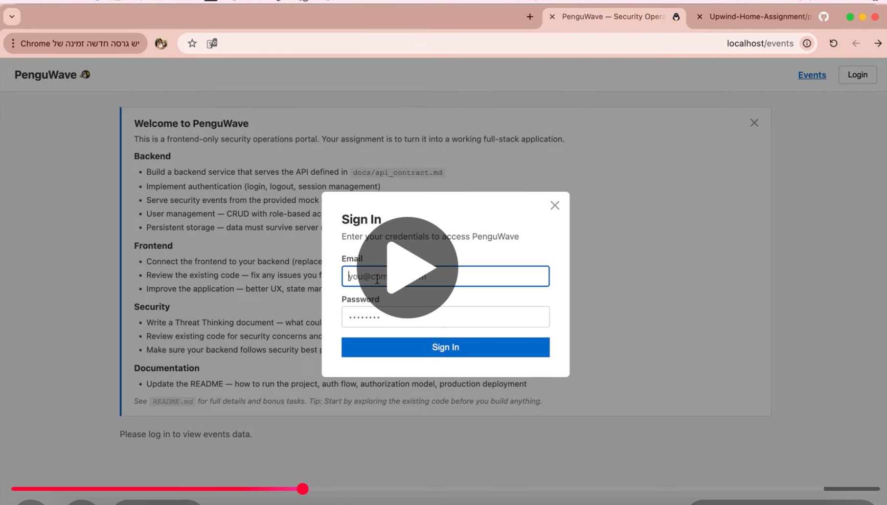

================================================================================
# PenguWave Analyst Portal — Secure Backend & Infrastructure Implementation
### **Module:** Part 2 — Secure Development Assessment Submission

================================================================================
---

## Architecture & Technology Stack

This subsystem establishes a secured, role-scoped full-stack environment designed for security analysts to monitor enterprise telemetry and manage platform access control.

### Core Component Stack
* **Runtime Environments:** Python, Node.js
* **Application Frameworks:** FastAPI (Asynchronous Python Web Framework), React (Frontend Engine)
* **Data Persistence:** SQLite, SQLAlchemy Object-Relational Mapper (ORM)
* **Cryptographic Baselines:** Bcrypt (Password Serialization), HS256 Signed JSON Web Tokens (JWT)
* **Infrastructure Containerization:** Docker, Docker Compose, Nginx (Reverse Proxy)

---

## Repository Substructure
```text
part2-backend/
│
├── backend/
│   ├── main.py                # FastAPI application entry point
│   ├── database.py            # Database connection and initialization
│   ├── models.py              # SQLAlchemy database models
│   ├── schemas.py             # Pydantic request/response schemas
│   ├── auth.py                # JWT authentication & password hashing
│   ├── requirements.txt       # Python dependencies
│   └── database.db            # Local SQLite database file
│
├── PenguWave-main/
│   ├── data/
│   │   └── mock_events.json   # Mock security events dataset
│   │
│   ├── src/
│   │   ├── api.ts             # Centralized API communication layer
│   │   ├── App.tsx            # Main application routing/layout
│   │   ├── pages/             # Main application views
│   │   └── components/        # Reusable UI components
│   │
│   ├── public/                # Static public frontend assets
│   ├── dist/                  # Production frontend build output
│   ├── docs/                  # Additional project documentation
│   ├── package.json           # Node.js project configuration
│   ├── package-lock.json      # Locked dependency versions
│   ├── vite.config.ts         # Vite frontend build configuration
│   ├── Dockerfile             # Frontend container definition
│   └── nginx.conf             # Nginx reverse proxy configuration
│
├── docker-compose.yml         # Multi-container orchestration
├── README.md                  # Project documentation
├── THREAT_ANALYSIS.md         # Security threat analysis
└── .env                       # Environment variables (ignored in production)
```
---

## Deployment & Verification Guide

### Orchestrated Deployment via Docker Compose
To mitigate configuration drift and ensure state isolation, execution through the container mesh is required. Execute from the `part2-backend` directory root:

# Purge previous execution states, containers, and isolated volumes
```bash
docker compose down -v
```

# Compile, build layers, and initialize the isolated service mesh in detached background mode
```bash
docker compose up --build --force-recreate -d
```

#### Service Gateway Endpoints
* **Analyst User Interface:** http://localhost (Routed via Nginx)
* **Backend API Gateway:** http://localhost:3001

---

### Alternative Manual Infrastructure Initialization (Testing Only)

#### 1. Core Service Engine Setup
```bash
cd backend
python -m venv venv
```


* Activation (POSIX): source venv/bin/activate
* Activation (Windows): venv\Scripts\activate

```bash
pip install -r requirements.txt
python main.py
```

*Upon initial bootstrap execution, the backend engine automatically instantiates the localized persistent SQLite database (`database.db`), generates structural schemas, and injects runtime test data models.*

#### 2. Client-Side Interface Compilation
```bash
cd PenguWave-main
npm install
npm run dev
```

* Interface operational gateway defaults locally to: http://localhost:5173

---

## Seed Accounts & Access Matrix

Authentication and authorization layers can be validated utilizing the following pre-seeded test credentials:
| Target Account | Identity (Email) | Cleartext Credential | Authorization Scope / State |
| :--- | :--- | :--- | :--- |
| **Administrator** | `admin@penguwave.io` | `admin123` | Complete administrative privileges and user management scope. |
| **Security Analyst** | `analyst@penguwave.io` | `pass456` | Read-only access restricted exclusively to event telemetry. |
| **Disabled Account** | `viewer@penguwave.io` | `view789` | Explicitly revoked access status (simulated lockout). |

---

## Cryptographic Authentication Lifecycle

Session state verification is implemented via a stateless token model adhering to the following logical flow:

1. **Credential Ingestion:** The client posts a structured payload containing an identity and secret pair to the `/api/auth/login` gateway.
2. **Secret Verification:** The backend extracts the matching row and validates cleartext authenticity against the saved database hash using resource-bounded `bcrypt` routines.
3. **Token Issuance:** Upon explicit verification success, the server compiles and signs a stateless JSON Web Token (JWT) utilizing the `HS256` hashing signature.
4. **Client Ingestion:** The client runtime captures the token payload, persisting the signed token inside `LocalStorage`.
5. **Authenticated Request Loop:** Subsequent API calls append the authorization artifact inside explicit request headers:
   Authorization: Bearer <token>
6. **Server Validation:** The backend decodes, parses, and validates the integrity of the cryptographic signature prior to route resolution.

*Session Lifetimes: Access tokens are mathematically bound to expire after a 1-hour window.*

---

## Server-Side Authorization Enforcements (RBAC)

The system operates under a strict server-side Role-Based Access Control (RBAC) perimeter. Client-side UI adaptations (such as stripping tabs from user views) are implemented exclusively for usability purposes; all data controls are validated at the API boundaries.

* **Administrative Scope:** Granted unfiltered read/write privileges over telemetry feeds and the User Management database parameters. Authorized to provision new analyst profiles and toggle execution records (self-deletion actions are structurally blocked).
* **Analyst / Non-Admin Scope:** Restricted exclusively to parsing read-only event telemetry. Blocked from accessing administrative route parameters or mutating user records.

### Error Response Mapping
* `401 Unauthorized`: Request missing a validated cryptographic token string.
* `403 Forbidden`: Request contains a valid signature, but the underlying identity scope lacks sufficient permission boundaries.

---

## Subsystem API Blueprint

### Security Telemetry Routes
* `GET /api/events` — Fetches security incident records from the system backend (Requires active authentication token).

### Identity Management Routes (Admin Only)
* `GET /api/users` — Queries complete system identity registry data.
* `POST /api/users` — Provisions a new identity record with custom defined role parameters.
* `DELETE /api/users/{user_id}` — Removes an active user account record from persistence.

### System Control Routes
* `GET /api/health` — Verifies API responsiveness and structural status.

---

## Data Layer & Structural Hardening

The persistence engine applies defenses against input manipulation vectors:
* **Query Parameterization:** Interacting via SQLAlchemy ORM abstractions natively prevents traditional SQL Injection (SQLi) vectors.
* **Sanitized Storage Profiles:** Cleartext passwords are never committed to permanent disk media; tables store only securely cryptographically salted hashes (`bcrypt`), defined roles, and operational status parameters.

---

## Production Security Posture & Mitigations

To transition this architecture from local evaluation boundaries into enterprise-grade hosting profiles, the following infrastructural mitigations must be implemented:

1. **Transport Layer Hardening:** Enforce uniform TLS termination rules across all ingress points, mandating strict HTTPS connections.
2. **Token Session Migration:** Move session management artifacts out of browser `LocalStorage` into signed `HttpOnly`, `SameSite=Strict` secure cookies to eliminate Cross-Site Scripting (XSS) session extraction vulnerabilities.
3. **Database Layer Scaling:** Replace the embedded single-file SQLite database with an enterprise relational system like PostgreSQL to enable network isolation and proper concurrent transactions.
4. **Secret Lifecycle Management:** Strip all configuration baselines out of configuration files, substituting runtime injection via decoupled Cloud Secret Management utilities.
5. **Rate-Limiting Matrices:** Deploy explicit boundary rate-limiting engines across critical API endpoints (`/api/auth/login`) to blunt automated online credential brute-force attempts.
6. **Telemetry & SIEM Aggregation:** Pipe structural event logs and infrastructure audits out to central Security Information and Event Management (SIEM) systems to ensure append-only visibility preservation.

---

## Development & Assessment Boundaries

This codebase has been optimized for assessment and auditing efficiency. Environment files (`.env`) and local database configuration defaults are purposefully tracked within this testing layout to ensure immediate single-command execution and zero-friction evaluation by the reviewing team.

---

## Demo Video

Here is a short video demonstration of the PenguWave application in action, showcasing its core features and workflows:

[](https://youtu.be/AKjDqY6Ae14)